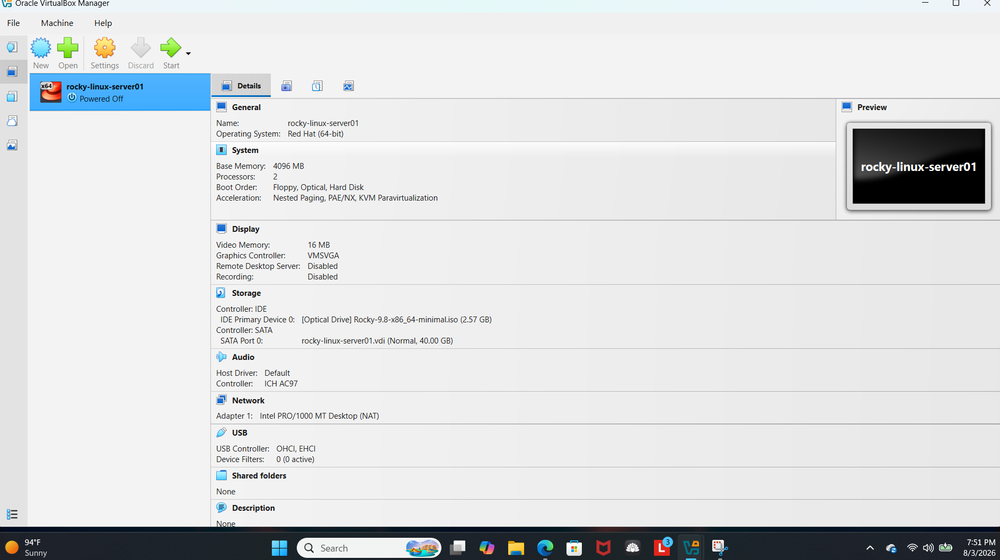
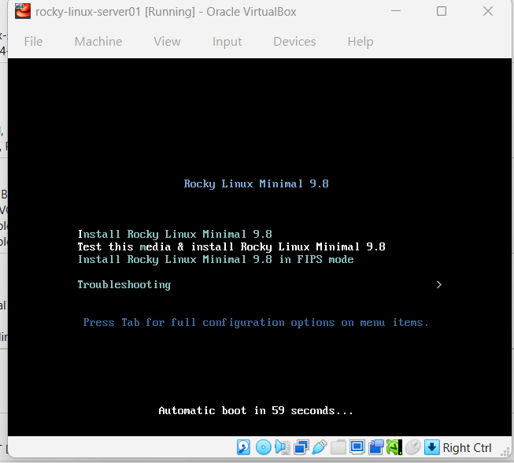
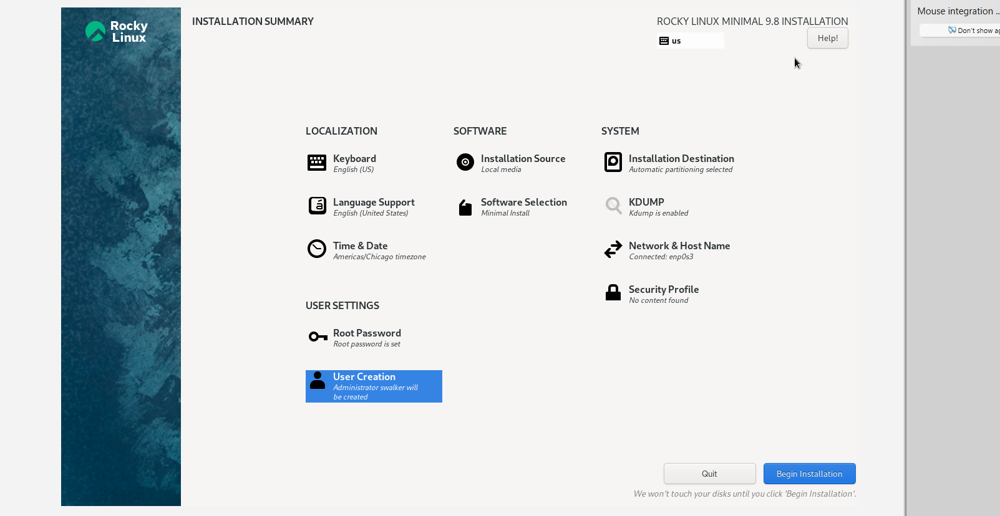
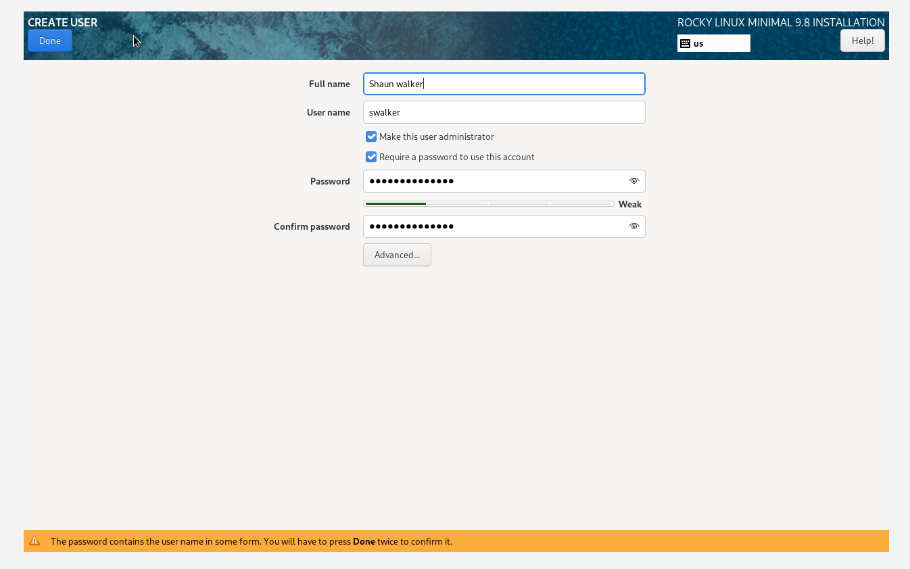
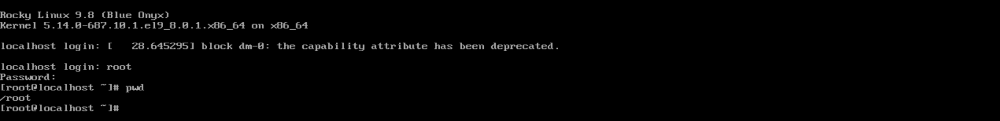
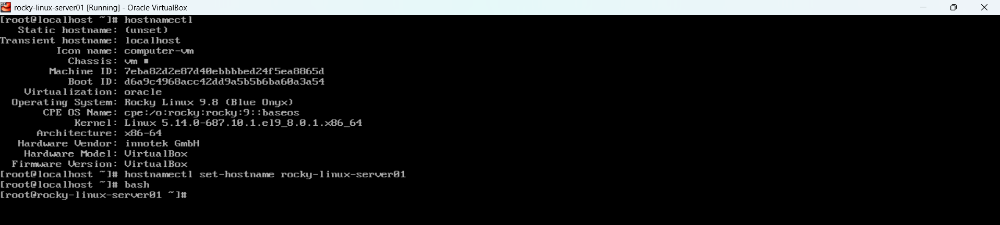
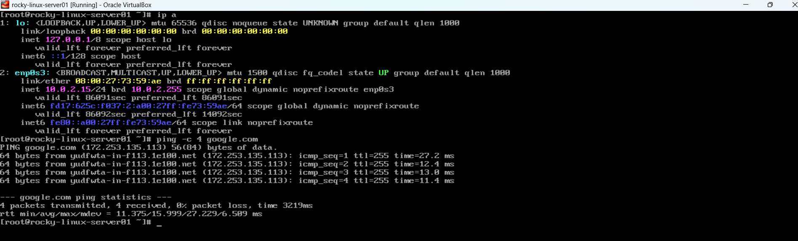
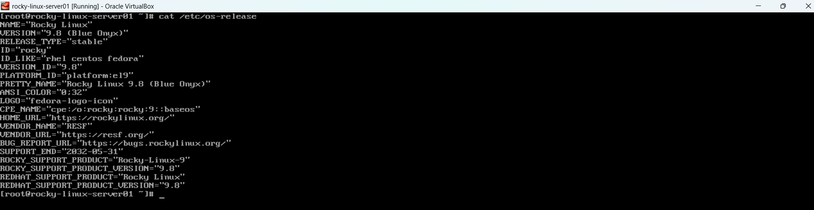
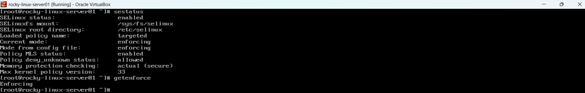
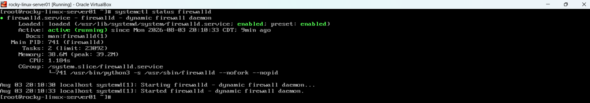

# 🚀 Project 01 – Rocky Linux Deployment & Initial Configuration

> **Why I Built This Project**
>
> I'm building this home lab to gain real-world Linux experience and create a portfolio that demonstrates my skills as I work toward becoming a Linux Systems Engineer. Every project in this repository is completed by me, documented with screenshots, and designed to build on the previous one.

---

# 📖 Project Overview

This is the first project in my Linux Home Lab series.

For this project, I deployed a Rocky Linux 9 virtual machine using Oracle VirtualBox and completed the initial server configuration. My goal wasn't just to install Linux—I wanted to understand the deployment process, verify that the system was configured correctly, and document everything like I would in a real IT environment.

This virtual machine will serve as the foundation for future projects covering user and group administration, storage management, networking, SELinux, firewalld, Apache, NFS, automation with Ansible, containers, and cloud technologies.

---

# 🎯 Objectives

For this project I wanted to:

- Deploy Rocky Linux 9 in Oracle VirtualBox
- Configure a Linux server from scratch
- Verify core system configuration
- Validate networking and security services
- Build professional documentation using GitHub

---

# 🖥️ Lab Environment

## Hardware

- **Host Operating System:** Windows 11
- **Memory:** 32 GB RAM
- **Storage:** 1 TB SSD

## Software

- Oracle VirtualBox
- Rocky Linux 9

---

# ⚙️ Virtual Machine Configuration

I created a new Rocky Linux virtual machine in Oracle VirtualBox to simulate a Linux server that will be used throughout my home lab.

### Configuration

- **VM Name:** `rocky-linux-server01`
- **CPU:** 2 vCPU
- **Memory:** 4 GB
- **Storage:** 40 GB
- **Network:** NAT



---

# 💿 Rocky Linux Installer

After creating the virtual machine, I mounted the Rocky Linux ISO and successfully booted into the installer. This confirmed that the installation media loaded correctly and the deployment process could begin.



---

# 🛠️ Installation Summary

Before installing the operating system, I reviewed and configured the installation settings including language, storage, and system configuration.



---

# 👤 User Account Creation

During the installation process, I created an administrative user account that will be used to manage the server throughout future projects.



---

# ✅ First Login

Once the installation finished, I logged into Rocky Linux for the first time and confirmed that the operating system was installed successfully.



---

# 🖥️ Hostname Verification

After logging in, I verified the hostname and operating system information to ensure the server was configured correctly.

### Command Used

```bash
hostnamectl
```



---

# 🌐 Network Verification

Next, I verified the network configuration to make sure the server received an IP address and was ready for future networking labs.

### Command Used

```bash
ip addr
```



---

# 📋 System Information

To confirm the operating system installation, I checked the installed Rocky Linux version.

### Command Used

```bash
cat /etc/os-release
```



---

# 🔒 SELinux Verification

Security is an important part of Linux administration. I verified that SELinux was enabled and running in **Enforcing** mode.

### Command Used

```bash
getenforce
```

**Expected Output**

```
Enforcing
```



---

# 🔥 Firewall Verification

Finally, I confirmed that the `firewalld` service was active and protecting the server.

### Command Used

```bash
systemctl status firewalld
```



---

# 💡 What I Learned

This project gave me a much better understanding of what goes into deploying a Linux server from the ground up. Instead of simply installing an operating system, I learned how to verify system configuration, validate security services, and document each step of the deployment process.

One thing I want this GitHub repository to show is not only what I know today, but also how my skills continue to grow as I complete more advanced Linux and infrastructure projects.

---

# 🧰 Skills Demonstrated

- Rocky Linux 9
- Oracle VirtualBox
- Linux Installation
- Linux Command Line
- Hostname Configuration
- Network Verification
- SELinux
- Firewalld
- Technical Documentation
- Git & GitHub

---

# 🚀 Next Project

The next project in this home lab series focuses on **Linux User & Group Administration**, where I'll practice creating users and groups, managing passwords, configuring permissions, and applying administrative privileges.
