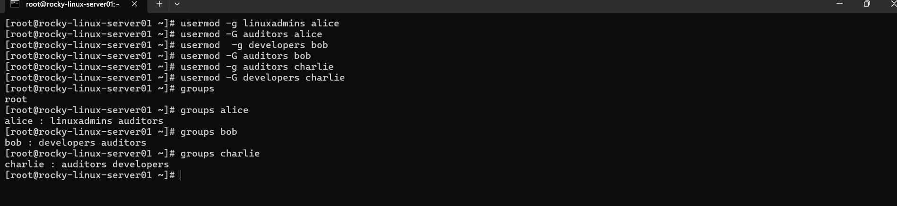
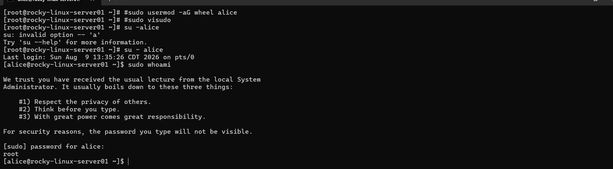
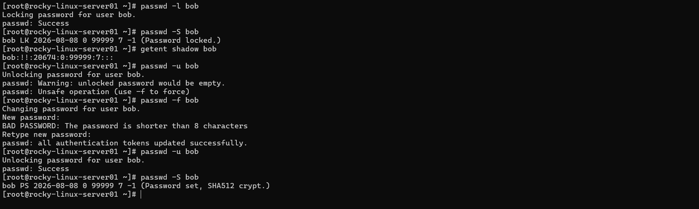
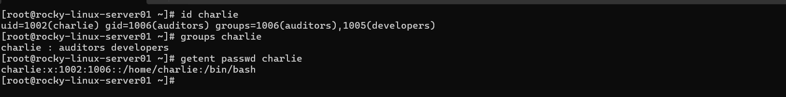
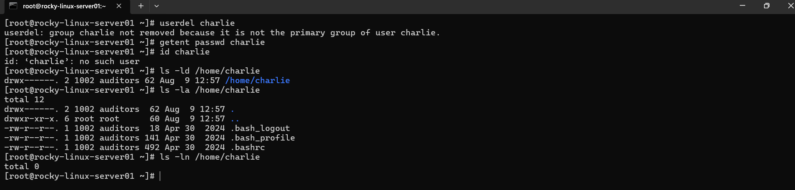

# 👥 Project 02 – Linux User & Group Administration

> **Why I Built This Project**
>
> After setting up my Rocky Linux server, the next step was learning how to properly manage access to it. In a real IT environment, users should not all have the same level of access. This project focuses on building that access structure through Linux users, groups, and administrative privileges.
>
> I'm using this lab to practice the same type of account management tasks a Linux Systems Administrator would perform when onboarding employees, assigning access, and offboarding users.

---

# 📚 Project Overview

This is the second project in my Linux Home Lab series.

For this project, I took on the role of a Junior Linux Systems Administrator responsible for configuring access for a small IT department.

The team includes a Linux Administrator, a Developer, and a Security Auditor. Each employee needs different access based on their responsibilities, so I created user accounts, department groups, group memberships, and administrative access while verifying each configuration along the way.

The project also includes account locking, account auditing, and employee offboarding to simulate common tasks that take place throughout the employee lifecycle.

---

# 🎯 Objectives

For this project I wanted to:

- Create and manage Linux user accounts
- Create department-based Linux groups
- Assign users to appropriate groups
- Practice primary and supplementary group management
- Configure administrative access using `sudo`
- Practice locking and unlocking user accounts
- Audit Linux account information
- Safely remove a user during an offboarding scenario
- Verify each configuration through the Linux command line
- Document the entire process with GitHub

---

# 🏢 IT Team Scenario

I created a small fictional IT department to simulate a real-world access management environment.

### 👨‍💻 Linux Administrator

**User:** `alice`

**Group:** `linuxadmins`

Alice is responsible for managing the Linux server and performing authorized administrative tasks.

### 🧑‍💻 Developer

**User:** `bob`

**Group:** `developers`

Bob is responsible for application development and testing within the environment.

### 🛡️ Security Auditor

**User:** `charlie`

**Group:** `auditors`

Charlie is responsible for reviewing system configuration and auditing access.

---

# 👥 Department Groups

The following groups were created to represent different responsibilities within the IT department:

```text
linuxadmins
developers
auditors
```

Using groups allows access to be managed based on job responsibilities instead of assigning permissions individually to every user.


---

# 👤 User Account Creation

I created individual Linux accounts for Alice, Bob, and Charlie to represent the employees in the IT department.

The accounts were verified after creation to make sure each user existed correctly on the system.

### Users

```text
alice
bob
charlie
```


---

# 🏷️ Group Configuration & Membership

Department-based groups were created to organize users according to their responsibilities.

### Groups

```text
linuxadmins
developers
auditors
```

I then assigned the appropriate users to their respective groups and verified the memberships.

This also allowed me to practice the difference between a user's primary group and their supplementary group memberships.



---

# 🔗 Primary & Supplementary Groups

Linux allows users to have both a primary group and additional supplementary groups.

Using the group configuration above, I verified how each user's primary and supplementary group memberships were assigned.

This helped reinforce how Linux determines a user's group associations and how group-based access can be organized.

---

# 🔐 Administrative Access

Alice is the Linux Administrator for this environment.

I configured her account so she could perform authorized administrative tasks using `sudo`.

The configuration was then tested to verify that the administrative access actually worked as intended.

### Verification

The goal was not simply to configure administrative access, but to test the configuration and confirm the result.



---

# 🔒 Account Locking & Unlocking

Account access is an important part of user administration.

For this portion of the lab, I practiced:

1. Locking a user account
2. Verifying the account's locked state
3. Unlocking the account
4. Confirming the account was available again

This simulated a common administrative task that may be required when temporarily disabling an employee's access.



---

# 🔎 Account Auditing

Before making changes to a user's account, I reviewed the account information available on the system.

The information included:

- Username
- User ID (UID)
- Primary Group ID (GID)
- Group memberships
- Home directory
- Login shell

This provided hands-on practice with gathering account information that a Linux administrator may need during troubleshooting or access reviews.



---

# 🚪 Employee Offboarding

For the final part of the project, I simulated an employee leaving the company.

Charlie was selected for the offboarding scenario.

The process included:

- Removing the user's Linux account
- Verifying that the account no longer existed
- Checking what happened to the user's home directory
- Documenting the results

I specifically avoided automatically deleting the home directory so I could understand what happens to user data when an account is removed.



---

# 🧠 What I Learned

This project helped me understand that Linux user management is more than simply creating accounts.

I practiced organizing users around job responsibilities, managing group memberships, configuring administrative access, and handling account lifecycle tasks.

One of the biggest takeaways from this project was understanding how groups can be used to manage access more efficiently. Instead of configuring access for every individual user, administrators can organize users into groups based on their responsibilities.

I also got hands-on experience with account locking, auditing, and offboarding—tasks that are common in real-world IT environments.

---

# 🛠️ Skills Demonstrated

- Rocky Linux 9
- Linux User Administration
- Linux Group Administration
- Primary & Supplementary Groups
- `sudo` & Administrative Access
- Account Locking & Unlocking
- User Account Auditing
- Employee Offboarding
- Linux Command Line
- Access Management
- Technical Documentation
- Git & GitHub

---

# 🚀 Next Project

The next project in my Linux Home Lab will focus on **Linux File Permissions & Access Control**, where I'll build on the user and group management skills from this project and learn how Linux controls access to files and directories.
