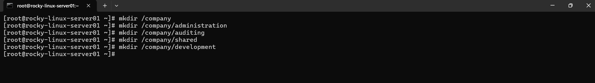
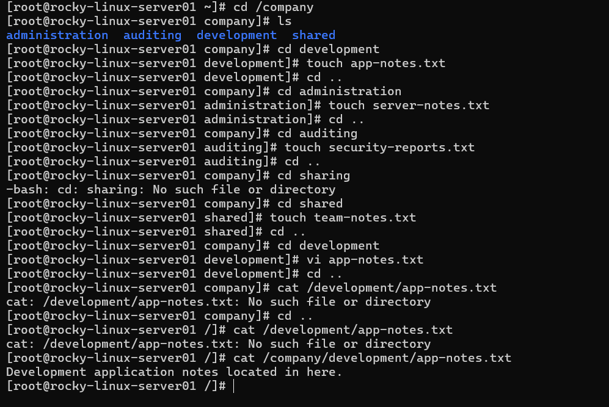
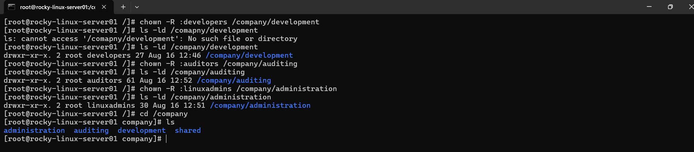
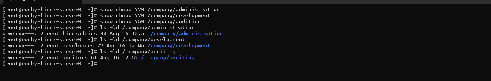
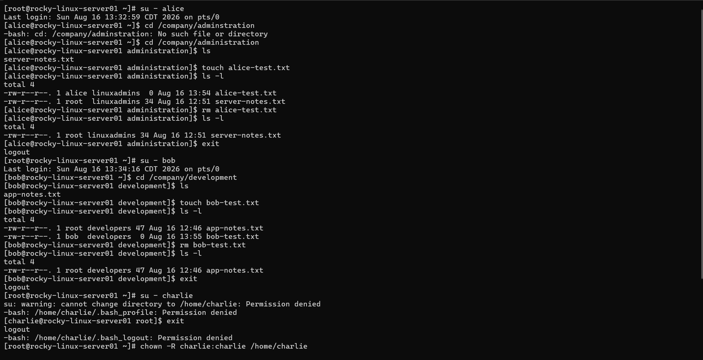
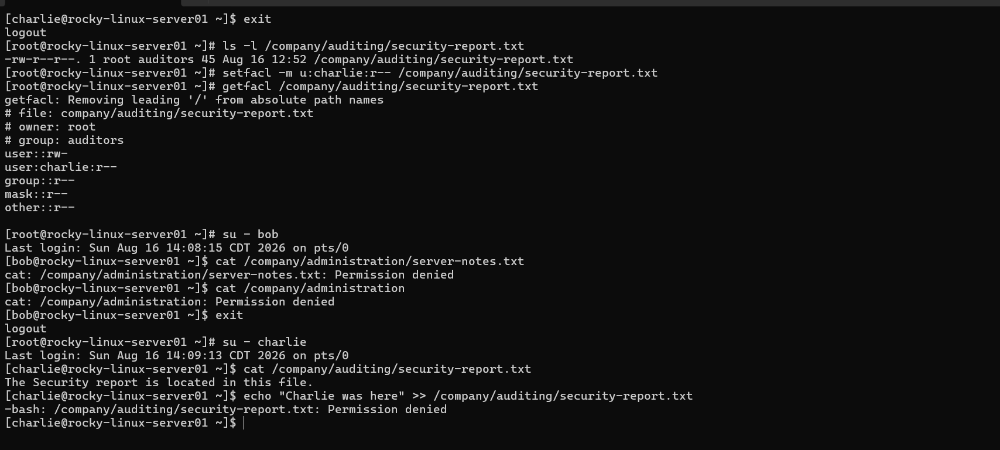
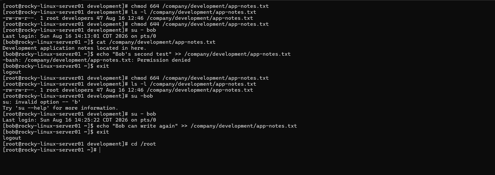
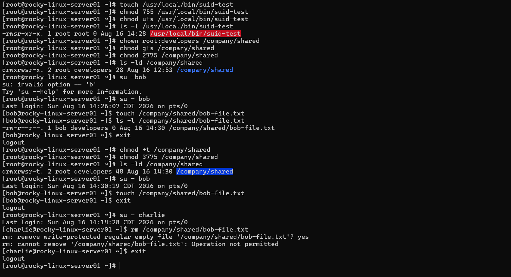
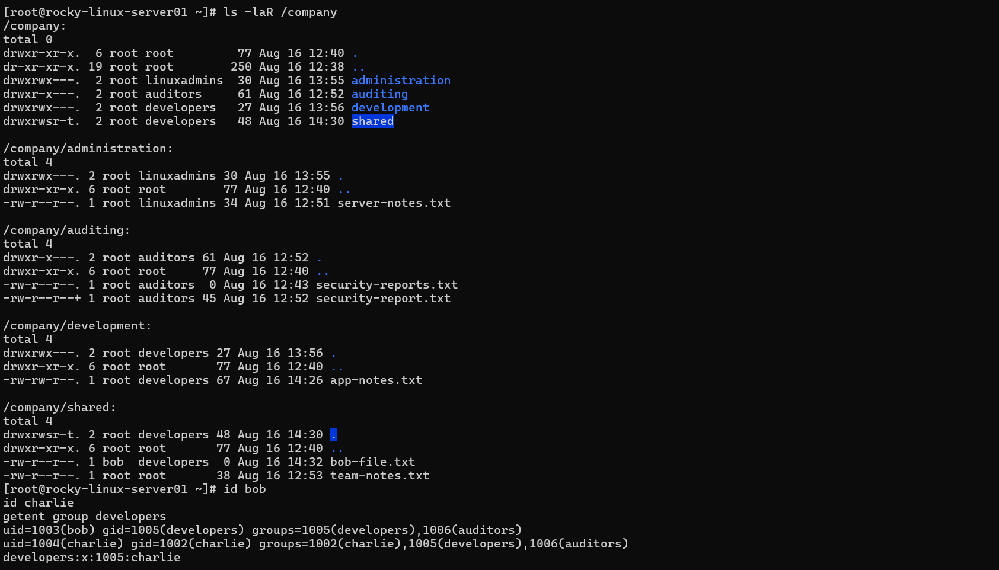

# 🔐 Project 03 – Linux File Permissions & Access Control

> **Why I Built This Project**
>
> After learning how to create and manage users and groups in Project 02, the next step was understanding how Linux actually controls what those users can access.
>
> In a real IT environment, simply creating user accounts isn't enough. Administrators need to make sure employees can access the resources required for their jobs while preventing unauthorized access to sensitive information.
>
> This project focuses on Linux ownership, file permissions, group-based access control, and special permissions such as SUID, SGID, and the Sticky Bit.
>
> I'm using this lab to practice the same type of access-control and troubleshooting tasks a Linux Systems Administrator would perform when protecting company resources.

---

# 📚 Project Overview

This is the third project in my Linux Home Lab series.

For this project, I continued the role of a Junior Linux Systems Administrator responsible for managing access to a company Rocky Linux server.

Using the users and groups created in Project 02, I built a company directory structure containing separate resources for the administration, development, auditing, and shared IT departments.

I then configured ownership and permissions based on each employee's responsibilities and tested both authorized and unauthorized access.

The project also included troubleshooting permission changes and practicing Linux special permissions including SUID, SGID, and the Sticky Bit.

---

# 🎯 Objectives

For this project I wanted to:

* Create a realistic company directory structure
* Create department-specific files
* Configure Linux file and directory ownership
* Configure user and group permissions
* Practice read, write, and execute permissions
* Use group-based access control
* Test authorized user access
* Test unauthorized access attempts
* Troubleshoot permission-related problems
* Practice SUID permissions
* Practice SGID permissions
* Practice the Sticky Bit
* Verify the final access-control configuration
* Document the entire process with GitHub

---

# 🏢 IT Environment

I continued using the fictional IT department from Project 02.

### 👨‍💻 Linux Administrator

**User:** `alice`

**Group:** `linuxadmins`

Alice is responsible for managing the Linux server and administration resources.

### 🧑‍💻 Developer

**User:** `bob`

**Group:** `developers`

Bob is responsible for application development and development resources.

### 🛡️ Security Auditor

**User:** `charlie`

**Group:** `auditors`

Charlie is responsible for reviewing security-related information and auditing system resources.

---

# 📁 Step 1 — Company Directory Structure

I created a company directory structure to separate resources by department.

```text
/company
├── administration
├── auditing
├── development
└── shared
```

The directory structure provides a foundation for organizing resources and applying different access-control policies to each department.

### 📸 Screenshot



---

# 📄 Step 2 — Company Resource Files

I created department-specific files to represent resources that would exist in a real IT environment.

```text
/company/development/app-notes.txt

/company/administration/server-notes.txt

/company/auditing/security-report.txt

/company/shared/team-notes.txt
```

Each file contained sample information that could later be accessed or modified according to the user's role.

### 📸 Screenshot



---

# 👥 Step 3 — Ownership Configuration

I configured group ownership based on the department responsible for each resource.

### Administration

```text
/company/administration → linuxadmins
```

### Development

```text
/company/development → developers
```

### Auditing

```text
/company/auditing → auditors
```

The shared directory was handled separately because it was used to practice special permissions.

This reinforced how Linux ownership can be used together with groups to create structured access-control policies.

### 📸 Screenshot



---

# 🔐 Step 4 — Linux File Permissions

After configuring ownership, I configured Linux permissions based on the responsibilities of each employee.

The goal was to provide users with the access they needed without giving unnecessary permissions.

### Administration

Alice was given the ability to read and modify administration resources.

Bob and Charlie were restricted from accessing those resources.

### Development

Bob was given read and write access to development resources.

Alice retained administrative access to the system.

Charlie was restricted from modifying development resources.

### Auditing

Charlie was given read access to security reports without write access.

This allowed him to perform his auditing responsibilities while protecting the integrity of the reports.

I intentionally avoided using overly permissive configurations such as `777` and instead configured access according to actual job responsibilities.

### 📸 Screenshot



---

# 🧪 Step 5 — Authorized User Access Testing

After configuring the permissions, I tested the accounts to verify that authorized users could perform their assigned tasks.

### Alice

```text
Alice → Administration → SUCCESS
```

Alice was able to access and modify the administration resources assigned to her role.

### Bob

```text
Bob → Development → SUCCESS
```

Bob was able to access and modify development resources.

### Charlie

```text
Charlie → Auditing → READ SUCCESS
```

Charlie was able to read the security report while remaining restricted from modifying it.

```text
Charlie → Auditing → WRITE DENIED
```

This demonstrated that the permissions were enforcing the intended access levels.

### 📸 Screenshot



---

# 🚫 Step 6 — Unauthorized Access Testing

I also tested users attempting to access resources outside of their responsibilities.

For example, Bob attempted to access or modify the administration resources.

The system correctly prevented the unauthorized operation.

```text
Permission denied
```

I also tested Charlie's access to the auditing report.

Charlie was able to read the report but was prevented from modifying it.

This was important because access-control configurations should be tested from both sides: what users **can** access and what they **cannot** access.

### 📸 Screenshot



---

# 🔄 Step 7 — Permission Modification & Troubleshooting

I intentionally modified permissions on one of the resources to simulate a real-world permission problem.

Bob originally had:

```text
Read + Write
```

I then removed his write permission:

```text
Read only
```

After changing the permissions, I tested Bob's access again and verified that his ability to modify the resource had been removed.

I then restored the correct permissions and confirmed that Bob could modify the resource again.

This exercise helped me understand how quickly a permission change can affect user access and how administrators can troubleshoot those issues.

### 📸 Screenshot



---

# 👑 Step 8 — Linux Special Permissions

I also practiced Linux's three special permission types:

```text
SUID
SGID
Sticky Bit
```

### SUID

I reviewed how the SUID permission affects executable files and allows a program to execute with the permissions of the file's owner.

### SGID

I applied SGID to the shared directory:

```text
/company/shared
```

This allows newly created files and directories within the shared directory to inherit the directory's group ownership.

### Sticky Bit

I also practiced the Sticky Bit on the shared directory.

This allows users to create files in a shared location while preventing them from deleting files owned by other users.

These permissions provided additional hands-on experience with Linux access-control mechanisms beyond basic `chmod` and `chown` usage.

### 📸 Screenshot



---

# 🔎 Step 9 — Final Permission Verification

After completing the configuration, I performed a final audit of the `/company` directory structure.

I verified:

* Directory ownership
* File ownership
* Linux permissions
* Group memberships
* Authorized user access
* Unauthorized access restrictions
* SUID configuration
* SGID configuration
* Sticky Bit configuration

The final directory structure was:

```text
/company
├── administration
│   └── server-notes.txt
│
├── auditing
│   └── security-report.txt
│
├── development
│   └── app-notes.txt
│
└── shared
    └── team-notes.txt
```

The final verification confirmed that the access-control configuration was working as intended.

### 📸 Screenshot



---

# 🧠 What I Learned

This project helped me understand that Linux access control is much more than memorizing commands like `chmod` and `chown`.

I learned how **users, groups, ownership, and permissions work together** to control access to system resources.

One of the biggest takeaways from this project was understanding the importance of designing permissions around job responsibilities.

Instead of giving every user broad access, administrators can use groups and carefully configured permissions to provide users with exactly the access they need.

I also gained hands-on experience testing permissions instead of assuming they were configured correctly.

Testing both authorized and unauthorized access helped reinforce the importance of verifying security controls after configuration.

The troubleshooting portion also showed me how a simple permission change can prevent a user from performing their job and how administrators can identify and correct those issues.

Finally, practicing SUID, SGID, and the Sticky Bit gave me a better understanding of how Linux provides additional mechanisms for managing access in shared and privileged environments.

The overall access-control process I practiced was:

```text
Users
   ↓
Groups
   ↓
Ownership
   ↓
Permissions
   ↓
Access Control
   ↓
Testing
   ↓
Troubleshooting
```

---

# 🛠️ Skills Demonstrated

* Rocky Linux 9
* Linux File Permissions
* Linux Directory Permissions
* `chmod`
* `chown`
* `chgrp`
* Linux User & Group Management
* Primary & Supplementary Groups
* File Ownership
* Group-Based Access Control
* Read / Write / Execute Permissions
* Permission Troubleshooting
* SUID
* SGID
* Sticky Bit
* Access-Control Testing
* Security Hardening Fundamentals
* Linux Command Line
* Technical Documentation
* Git & GitHub

---

# 📸 Project Screenshots

All screenshots used throughout this project are stored in the `Screenshots` directory.

```text
Screenshots/
├── 01-directory-structure.png
├── 02-company-files.png
├── 03-file-ownership.png
├── 04-file-permissions.png
├── 05-user-access-testing.png
├── 06-permission-denied.png
├── 07-permission-change.png
├── 08-special-permissions.png
└── 09-final-permission-verification.png
```

---

# 🚀 Next Project

The next project in my Linux Home Lab will build on these access-control fundamentals and move deeper into **Linux Storage & File System Administration**.

The goal will be to practice managing disks, partitions, logical volumes, file systems, and storage resources—the type of infrastructure management commonly performed by Linux Systems Administrators.

